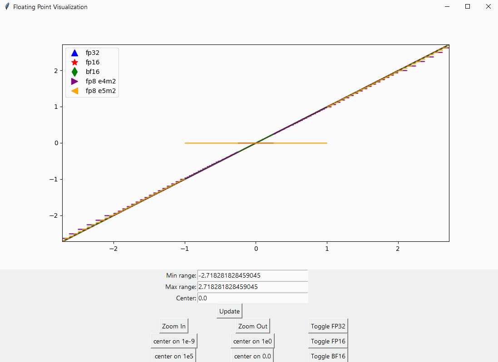

# Precision visualizer

This is a basic application that allows you to visualize the precision of a floating point number with various mantissa and exponent sizes along the real number line.

It is based off Olli Etuaho's [js app](http://oletus.github.io/float16-simulator.js/) ([code](https://github.com/Oletus/float16-simulator.js)) that has functions to simulate floating point operations at arbitrary precision, but converted to Python and using matplotlib for visualization along with common precisions implemented in Nvidia GPU or other hardware. 

## Requirements

- Python 3 (written in 3.10)
- tkinter
- matplotlib
- numpy

## Usage

`python precision.py`

Try out the zoom and recenter buttons to compare how different numbers are represented. For instance, try zooming in on the number 1.0 (1e0) and see how the precisions compare as you zoom in, or zoom to ~1e5 to see where FP16 range is limited (65,504).

### FP8

The simulation for FP8 is only trivially implemented and probably needs more investigation of the [FP8 paper](https://arxiv.org/abs/2209.05433) and the actual hardware implementation and behavior. 

### Further reading

Formats such as FP8, Int8 are typically used in heirarhical quantization schemes, with block-wise biases and scaling factors.

If you are interested in quantization you should start by reading [8-bit Optimizers via Block-wise Quantization](https://arxiv.org/abs/2110.02861) and the [LoRA: Low-Rank Adaptation of Large Language Models](https://arxiv.org/abs/2106.09685).  

